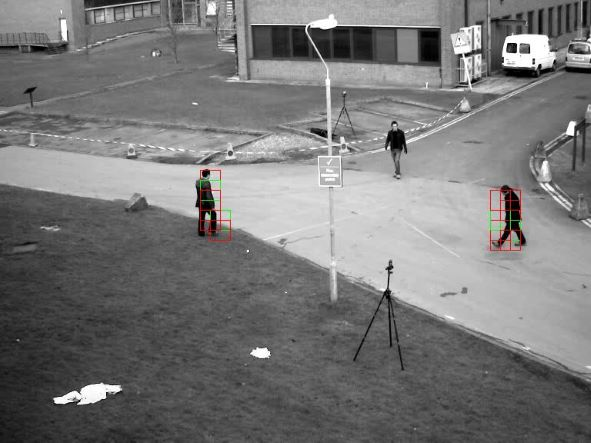

# Patch Matching Learner with Auto-Supervised 3d Convolution.

Using [PyTorch-Lightning](https://www.pytorchlightning.ai/).

## Introduction

Can we learn constrained temporal patch/block matching from automatically generated pixel shifted image pairs and successfully transfer inference to general image sequences? The MNIST test set and 4-point-pair-wise shifts are used as the *most* basic seed for transfer matching.

Thorough testing is application and data dependent. There are a number of interesting ways this could carried out and it is left to the user to decide how.

This demonstrator uses [PyTorch-Lightning](https://www.pytorchlightning.ai/) in a development mode that can be easily debugged and converted to a production CLI.

Single spatio-temporal offsets are used but extensions to multi-space-time scale are straight forward, see [kornia dog_response](https://kornia.readthedocs.io/en/latest/feature.html) for example. Output consists of boxes; green for 1 pixel shift, red for change probably greater than 1 pixel overlay in *./data/output/topk_diffs*.



Predict frames are expected to be ordered as frame_1, frame_2, ..., frame_n.

## Install

```bash
git clone https://github.com/davegdtec/PatchMatchLearner.git
```

```bash
cd .\PatchMatchLearner\
```

*If you are installing on wsl check [this](https://github.com/davegdtec/PatchMatchLearner/blob/main/doc/install_wsl.md) first.* For windows replace python3 with py.

```bash
python3 -m venv venv
```

```bash
source venv/bin/activate
```

```bash
pip3 install -r ./requirements.txt
```

```bash
python3 setup.py develop
```

## Run

A dev example is provided in *./dev/patch_match_mnist_dev.py* which is helpful for debug and visualization. Otherwise run from command line.

Execute an initial install run:

```bash
python3 ./dev/patch_match_mnist_dev.py --visualize_shifts True
```

or

```bash
python3 ./dev/patch_match_mnist_dev.py --visualize_shifts True
```

The training data and montaged views of the mnist sub-set and shifted pairs are written to *./data* for inspection.

## Train

```bash
python3 ./main_cli/main_patch_match_train.py fit --config ./configs/config_patch_match_train.yaml
```

or

```bash
python3 ./main_cli/main_patch_match_train.py fit --config ./configs/config_patch_match_train.yaml
```
 Checkpoints and hparams are written to *./data/output/lightning-logs/version_??*.

## Prediction

Note; edit the predict config to point to the checkpoint you want to use or specify it on the command line with the *./dev/patch_match_mnist_dev.py* version (or add to boiler plate...).

```bash
py ./main_cli/main_patch_match_predict.py predict --config ./configs/config_patch_match_predict_cows.yaml
```

or

```bash
python3 ./main_cli/main_patch_match_predict.py predict --config ./configs/config_patch_match_predict_cows.yaml
```

View *./data/output/topk_diffs*.